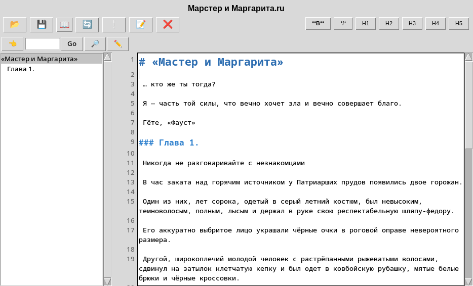

# MD Editor

Editor for md files *.md




## Требования

- Python 3.11+
- pip
- EbookLib
- reportlab

## Установка и запуск

1. Создайте виртуальное окружение:
   ```bash
   python -m venv .venv
   ```

2. Активируйте его:
   - macOS / Linux:
     ```bash
     source .venv/bin/activate
     ```
   - Windows:
     ```bash
     .venv\Scripts\activate
     ```

3. Установите зависимости:
   ```bash
   pip install -r requirements.txt
   ```

4. Запустите приложение:
   ```bash
   python main.py
   ```
