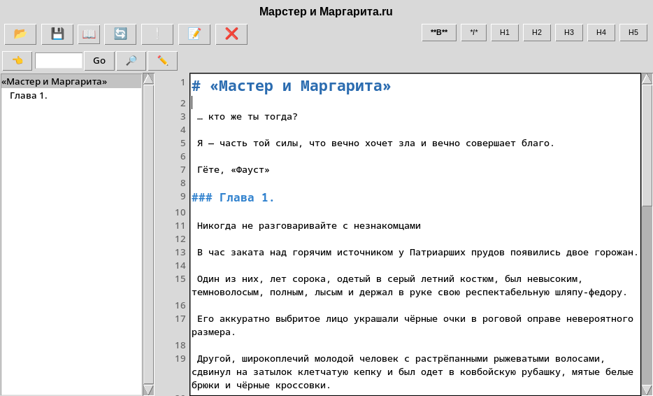

# MD Editor

Редактор для файлов Markdown (*.md).



## Описание проекта

MD Editor — это полнофункциональный редактор для работы с Markdown-документами. Проект предназначен для авторов, создающих структурированную документацию или книги.

**Ключевые особенности:**

*   **Полноценная среда редактирования:** Поддержка форматирования Markdown (заголовки H1-H5, жирный, курсив, код, ссылки) с мгновенной подсветкой синтаксиса.
*   **Автоматическое создание Оглавления (TOC):** В режиме реального времени редактор генерирует и обновляет список всех заголовков документа.
*   **Менеджер метаданных:** Инструмент для управления метаданными книги (название, автор, язык, теги, описание), связанными с MD-файлом.
*   **Инструменты повышения качества:** Встроенный текстовый корректор для автоматической проверки и исправления типовых ошибок и стилистических несоответствий.
*   **Поиск и замена:** Функционал глобального поиска и замены текста, включая поддержку регулярных выражений.
*   **Экспорт в готовый формат:** Возможность экспортировать готовый документ в форматы EPUB или PDF.

## Требования

Для работы редактора необходимо наличие:
*   Python 3.11+
*   pip (менеджер пакетов Python)
*   библиотеки EbookLib и reportlab

## Установка и запуск

Следуйте этим шагам для настройки и запуска проекта:

1.  **Создание виртуального окружения (venv):**
    ```bash
    python -m venv .venv
    ```

2.  **Активация виртуального окружения:**
    *   **macOS / Linux:**
        ```bash
        source .venv/bin/activate
        ```
    *   **Windows:**
        ```bash
        .venv\Scripts\activate
        ```

3.  **Установка зависимостей:**
    Установите все необходимые библиотеки, указанные в файле `requirements.txt`.
    ```bash
    pip install -r requirements.txt
    ```

4.  **Запуск приложения:**
    Запустите основной файл редактора:
    ```bash
    python main.py
    ```
